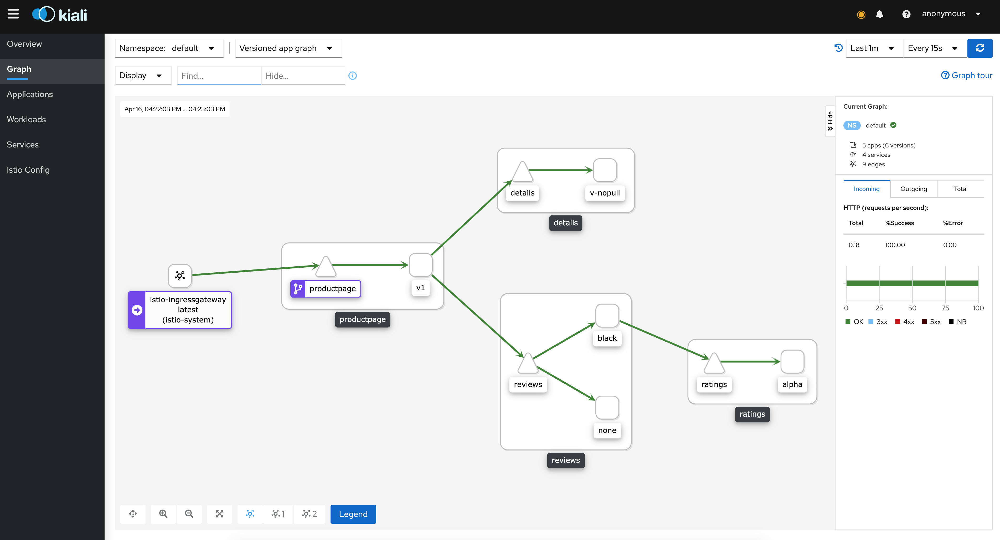
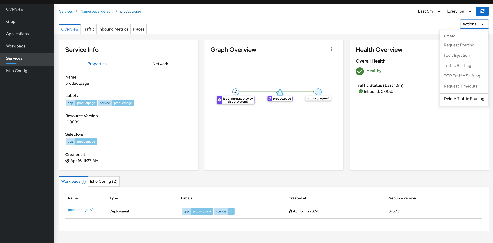
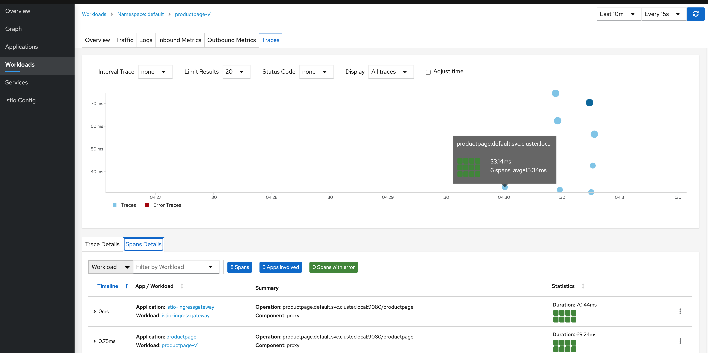
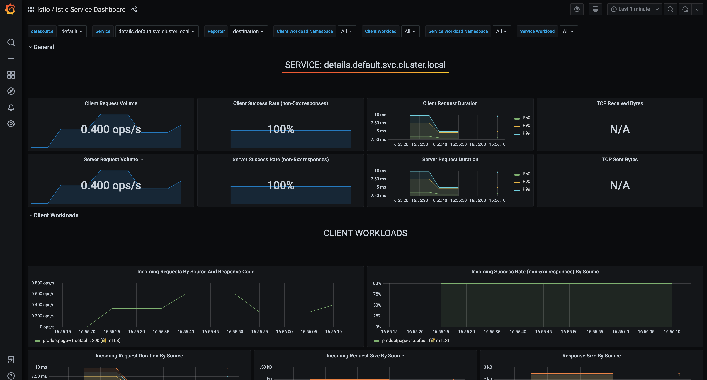

# Istio: a 101 hands-on session

This session aims to give a general overview of some of the most used Istio's features, focusing on traffic management and security. It will use the [bookinfo](https://istio.io/latest/docs/examples/bookinfo/) application, which is the focus of most tasks within Istio's documentation and is well suited for beginners. There has been some modifications to join together introductory tasks and make it a full journey into Istio.

Follow the prerequisites first to install istio and the bookinfo application as well as some variables which will make it a bit simpler to use. The entire session has been tested with a Kubernetes cluster deployed on Minikube, and commands executed from a bash shell.

Rather than going too deep into the entire concept and documentation, this session aims at having you try directly some of Istio's core features and focuses on the documentation relative to those. A [short summary](istio101.md) of Istio's concept and capabilities with links to the official documentation is also provided.

## Tasks

Please follow first the [initial installation tasks](tasks/prerequisites.md), then follow the links below.

1. [Routing Management](tasks/routing.md)
2. [Fault Injection](tasks/faultinjection.md)
3. [Circuit Breaker](tasks/circuitbreaker.md)
4. [Authorization](tasks/authorization.md)

During all these tasks you can observe visually the behavior of the requests in your mesh in Kiali. 

This is what kiali should display after following the initial prerequisites.

You can for instance configure the display to show the flow of requests and use the load generator from the authorization task (or any other) to continuously reload the productpage and see the traffic path of your requests according to the rules you have set in place.

It is also possible to edit directly the virtual services in Kiali (Services tab) if none have been created manually. You can at least see them in readonly mode.

You can also see the traces of your requests in the workload section or by accessing Jaeger (istioctl dashboard jaeger).

Use `istioctl dashboard grafana` to open the grafana dashboard in your browser and navigate to the `Istio Service Dashboard`. You should see metrics coming from Prometheus, with the request volume, request response code, etc.

